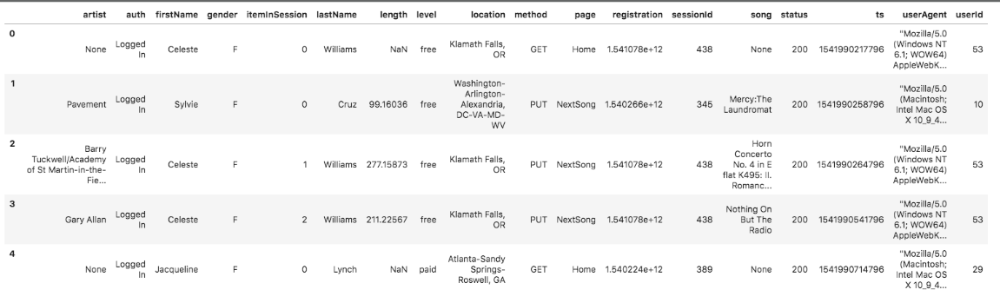
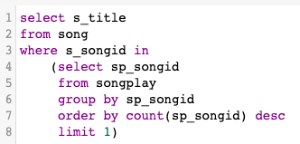
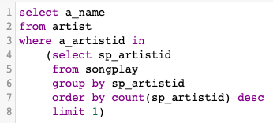

# Project Summary

### Background
This project is to help a startup called <strong>Sparkify</strong> to understand what songs users are listening to. Sparkify has been collecting on songs and user activity on their new music streaming app. 
As their use base and song database grow, they decide to move their processes and data onto cloud with two Amazon Web Services <strong>S3</strong> (simple storage service) and <strong>Redshift</strong> (Internet hosting service and data warehouse product). 

### Datasets
Two datasets that reside in S3:

<ol>
    <li><strong>Song Dataset</strong></li>
    > Each file is in JSON format and contains metadata about a song and the artist of that song.  
    > File names are like 'song_data/A/B/C/TRABCEI128F424C983.json' etc.  
    > In each file, data are like: {"num_songs": 1, "artist_id": "ARJIE2Y1187B994AB7", "artist_latitude": null, "artist_longitude": null, "artist_location": "", "artist_name": "Line Renaud", "song_id": "SOUPIRU12A6D4FA1E1", "title": "Der Kleine Dompfaff", "duration": 152.92036, "year": 0}
    <li><strong>Log Dataset</strong></li>
    > Each file is in JSON format and contains logs on user activity on the app  
    > File names are like 'log_data/2018/11/2018-11-12-events.json' etc.  
    > below is an example of what the data in a log file, 2018-11-12-events.json, looks like.
</ol>

    

### Tasks
1. **Redshift cluster setup**
    - launch a readshift database dc2.large cluster with 4 nodes
    - create an IAM role that has read access to S3
2. **Designing tables in _'sql_queries.py'_**
    - design fact and dimension tables for a star schema\
         fact table: songplays\
         dimension tables: users, songs, artists, time
    - design staging tables: staging_events, staging_songs
    - write a CREATE statement for each of these tables
    - write a DROP statements to drop tables if the tables already exist
3. **Creating tables in _'create_tables.py'_**
    - connect to the database
    - create fact, dimension, staging tables
4. **Buidling ETL pipeline in _'etl.py'_**
    - implement the logic to load data from S3 to staging tables on Redshift
    - implement the logic to load data from staging tables to analytics tables on Redshift
5. **Cluster cleanup**
    - remember to delete the Redshift cluster when finish

---
# To run the Python scripts
  1. Get _[Cluster]_ and _[IAM_ROLE]_ from Redshift to fill dwh.cfg file
  2. Click _File_ -> _New_ -> _Console_ at top menu bar
  3. Select kernel _Python3_
  4. Type `%run create_tables.py` in the console cell
  5. Click _Run_ -> _Run selected cell_ at top menu bar
  6. Type `%run etl.py` in the console cell
  7. Click _Run_ -> _Run selected cell_ at top menu bar
        
        
---
# Files in the repository
The project workspace includes five files:
- **_create_tables.py_** creates the fact and dimension tables for the star schema in Redshift.
- **_etl.py_** loads data from S3 into staging tables on Redshift and then process that data into the fact and dimension tables on Redshift.
- **_sql_queries.py_**  contains all sql queries, which are imported into the last two files above.
- **_dwh.cfg_**  stores cluster, IAM role, S3 file path information, which are imported into the last three files above.
- **_README.md_**  this file provides discussion on the project.
        

---
# Results

**Analysis on songplay table**

1. The most popular song is 'You're The One'

    query:
    
            
        
    result:
    
    

        
2. The most popular artistis 'Dwight Yoakam'

    query:
    
        

    result:

    
